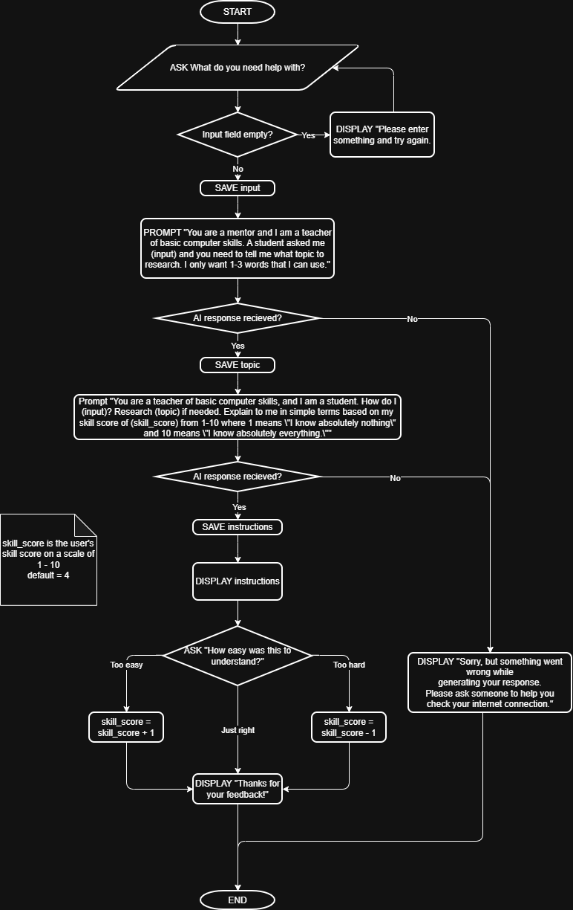

**DAY 4 HOMEWORK**

**Plan Your First AI Application Before Writing Python**

| Name: |  | Date: |  |
| :---- | :---- | :---- | :---- |
| **Project/Ap Name:** |  |  |  |
| **Assignment:** Complete all eight planning items for your own AI capstone idea. Do not begin coding until your plan is specific, testable, and easy to explain. **Submission:** Submit this completed document and upload it to your GitHub project folder using a clear filename such as day4\_ai\_app\_plan.docx. |  |  |  |

**1\. Clear Problem Statement**

**Write one specific sentence using this structure:** “Many \[users\] struggle with \[specific problem\] because \[reason\].”

| Helpful reminder: Describe the problem, not the features of your app. Avoid broad words such as “people,” “things,” or “everything.” |
| :---- |

**My problem statement:**

| Many first-time computer users struggle with surviving in the world because the world assumes they know how to use computers. |
| :---- |
|  |
|  |
|  |

**2\. User Story**

**Complete:** “As a \[type of user\], I want to \[action\], so that \[benefit\].”

**My user story:**

| As a person who doesn’t know how to use a computer, I want to learn how to use one at my own pace so that I can keep up with the world. |
| :---- |
|  |
|  |

**3\. Input–Process–Output (IPO) Chart**

**Input** is what the user gives the app. **Process** is what the app does. **Output** is what the user receives.

| INPUT | PROCESS | OUTPUT |
| ----- | ----- | ----- |
| User enters query | Prompt: You are a mentor and I am a teacher of basic computer skills. A student asked me (query) and you need to tell me what topic to research. I only want a few words that I can use. Output: relevant topic Prompt 2: You are a teacher of basic computer skills, and I am a student. How do I (relevant topic)? Explain to me simply. Output 2: (Simple instructions) Prompt 3: You are a writer. Some people don’t understand this (simple instructions). Break down the steps and make them simpler for them, and display them. Do not lose any information in the process. Output 3: (Output 2 but broken down into more steps) Repeat based on user skill score | Final output from the last iteration of prompt 3 User gives feedback (how simple the instructions were) |
|  |  |  |
|  |  |  |

**4\. Pseudocode**

**Write your program plan in plain English. Include:** START, user input, validation, processing, output, and END. Use IF/ELSE when the app must make a decision.

| START |
| :---- |
| REPEAT |
| ASK “What do you need help with?” |
| IF input field empty |
| DISPLAY "Please enter something and try again." |
| ELSE |
| BREAK |
| END IF |
| UNTIL TRUE |
| SAVE INPUT |
| PROMPT “You are a mentor and I am a teacher of basic computer skills. A student asked me (INPUT) and you need to tell me what topic to research. I only want 1-3 words that I can use.” |
| IF NOT AI response recieved |
| DISPLAY "Sorry, but something went wrong while generating your response. Please ask someone to help you check your internet connection." |
| END |
| END IF |
| SAVE TOPIC |
| PROMPT You are a teacher of basic computer skills, and I am a student. How do I (INPUT)? Research (TOPIC) if needed. Explain to me in simple terms based on my skill score of (SKILL_SCORE) from 1-10 where 1 means \"I know absolutely nothing\" and 10 means \"I know absolutely everything\". |
| IF NOT AI responds |
| DISPLAY "Sorry, but something went wrong while generating your response. Please ask someone to help you check your internet connection." |
| END |
| SAVE INSTRUCTIONS |
| DISPLAY INSTRUCTIONS |
| ASK "How easy were the steps to understand?" |
| DISPLAY "Too easy" \| "Just right" \| "Too hard" |
| IF FEEDBACK IS "Too easy" |
| SET SKILL_SCORE TO SKILL_SCORE + 1 |
| ELSE IF FEEDBACK IS "Too hard" |
| SET SKILL_SCORE TO SKILL_SCORE - 1 |
| DISPLAY "Thanks for your feedback!" |
| END |

**5\. Flowchart**

**Draw the order of your app. Include at least:** Start, Input, one Decision, Process, Output, and End. Label each arrow clearly.

| DRAW YOUR FLOWCHART HERE |
| :---: |
||

**6\. User Interface Sketch**

**Sketch what the user will see. Include:** app title, input areas, button(s), warning/error location, and output area.

| SKETCH YOUR APP SCREEN HERE |
| :---: |
||

**7\. Two Test Cases**

**For each test, show exactly what the user enters and what the app should return.** Use one normal test and one edge case, such as empty input, unclear wording, or missing information.

**Test Case 1**

| Test purpose | Normal test |
| :---- | ----- |
| **Exact input** | Accessing internet |
| **Expected output** |<ul><li>Step 1 ... </li><li>Step 2 ... </li><li>Step 3 ... </li></ul> (very simple instructions to use a browser)|
| **How I will know it passed** | The instructions correctly state the exact steps in accessing a webpage. |

**Test Case 2**

| Test purpose | Edge case |
| :---- | :---- |
| **Exact input** | Skibidi dop dop dop yes yes |
| **Expected output** |<ul><li>Step 1 ... </li><li>Step 2 ... </li><li>Step 3 ... </li></ul> (very simple instructions for somebody who is already at the level where they know Internet memes)|
| **How I will know it passed** | The guide can successfully teach a person how to make skibidi memes. |

**Test Case 3**

| Test purpose | Edge case |
| :---- | :---- |
| **Exact input** | a |
| **Expected output** |<ul><li>Step 1 ... </li><li>Step 2 ... </li><li>Step 3 ... </li></ul> (very simple instructions to type the letter A)|
| **How I will know it passed** | The guide correctly tells how to type the letter A. |

**8\. Scope Statement: Version 1**

**Keep your first version small.** List only the most important features under “Will Do.” Put future ideas and complicated integrations under “Will Not Do Yet.”

| VERSION 1 WILL DO | VERSION 1 WILL NOT DO YET |
| ----- | ----- |
| Give simple instructions on computer topics | Look at screenshots |
| Help troubleshoot problems | Automatically do computer tasks or fix computer problems |
|  |  |
|  |  |
|  |  |

**One-Breath Project Explanation**

Explain your project in 2–3 sentences: who it helps, what information it uses, what it does, and what result it provides.

| TechTeacher is an app that is meant to help first-time computer users learn how to use a computer by using the Internet to research the problem and creating a simple step-by-step guide on a computer topic. |
| :---- |
|  |
|  |
|  |

**Submission Checklist**

☐ I completed all eight sections.

☐ My problem statement is specific.

☐ My input, process, and output match each other.

☐ My pseudocode and flowchart show the same sequence.

☐ My interface sketch includes input, button, messages, and output.

☐ My two test cases include exact input and expected output.

☐ My Version 1 scope is small enough to build.

☐ I reviewed spelling and clarity.

☐ I saved the file with a clear lowercase filename.

☐ I uploaded the completed document to GitHub.

**Teacher Review (40 points)**

| Required Item | Points | Teacher Notes |
| ----- | :---: | ----- |
| 1\. Problem statement |  / 5 |  |
| 2\. User story |  / 5 |  |
| 3\. IPO chart |  / 5 |  |
| 4\. Pseudocode |  / 5 |  |
| 5\. Flowchart |  / 5 |  |
| 6\. Interface sketch |  / 5 |  |
| 7\. Two test cases |  / 5 |  |
| 8\. Scope statement |  / 5 |  |

